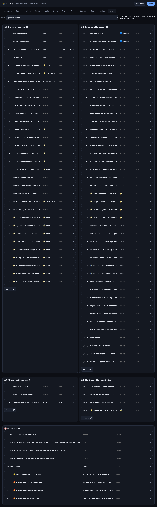

# Atlas — single-agent life dashboard

Clone of the Reddit "Life Atlas" idea, done **better**: one local SQLite
store, one brain (Hermes). No ChatGPT + Claude + Hermes MCP relay, no
nightly three-way "memory exchange" hack. The dashboard is just the UI over
one DB that Hermes reads and writes directly.

## Why this is better than the original
- **No context fragmentation.** The OP ran 3 separate assistants on the same
  DB and bolted on a nightly summary swap so they could "read each other's
  notes." That's three brains that never actually share context. Atlas has
  ONE brain — Hermes — so there's nothing to reconcile.
- **No multi-vendor API keys / MCP servers.** Just Python stdlib + a browser.
- **Auditable.** Every mutation Hermes makes is written to a `ledger` table
  you can open on the Ledger tab. The original's "memory exchange" was
  invisible glue.
- **Local-first, portable.** SQLite file under `~/.atlas/atlas.db`. Runs on
  your Mac or any VPS you control.
- **Open by default.** No paywall, no "contact me for the repo." Fork it,
  break it, ship your version. See [WHY_OPEN_SOURCE.md](WHY_OPEN_SOURCE.md).

## Run it
```bash
cd ~/atlas
python3 atlas_server.py
# open http://localhost:8731
```
Click **seed demo** to populate a starter corpus, then **+ add** to create
rows in any view. The Board tab is a Kanban over tasks; the Ledger tab shows
every change Hermes has made.

## The Covey 4-quad method (and why Atlas mirrors it)

Atlas includes a **Covey tab** that's a UI over your existing per-domain
`COVEY-BOARD.md` files — markdown is the source of truth, Atlas just edits it.

**What the Covey method is:** Stephen Covey's time-management matrix splits
work into four quadrants by *urgency* × *importance*:

| Quad | Name | What lives here | Your move |
|------|------|----------------|-----------|
| **Q1** | Urgent + Important | Fires, deadlines, crises | Do first, this week |
| **Q2** | Important, Not Urgent | Health, relationships, building, learning | Schedule it — this is where life actually compounds |
| **Q3** | Urgent, Not Important | Interruptions, other people's priorities | Minimize / delegate |
| **Q4** | Not Urgent, Not Important | Doom-scroll, busywork | Eliminate |

Plus a **Dailies** block (the AM #1 routine) that lives outside the quads.

The insight: most people drown in Q1 and Q3 while Q2 — the quadrant that
actually moves the needle — gets starved. The board is a forcing function to
keep Q2 fed.

**Why per-domain, not one global board:** Atlas keeps a *separate* board per
life domain (General Hopper / life, Trading, Writing, Grief-Shadow) rather
than collapsing everything into one grid. Different domains have different
Q2 engines; a single board hides that. Each domain is its own markdown file.

**Auto-backup:** every edit (add / edit / delete) snapshots the board to
`~/.atlas/covey-backups/COVEY-BOARD-<timestamp>.md` *before* writing — a
local-only, pre-edit undo point (deduped, last 50 kept). The board itself
stays **out of git**; it's your private operational brain, not repo material.



## Hermes integration
Hermes doesn't need an MCP server — it can just call the REST API (or the
SQLite file directly). Examples:
```bash
# add a task
curl -X POST localhost:8731/api/tasks \
  -H 'Content-Type: application/json' \
  -d '{"title":"Buy milk","status":"open","priority":3}'

# classify a captured note (the original needed Telegram→3 bots; here it's 1 call)
curl -X POST localhost:8731/api/notes \
  -H 'Content-Type: application/json' \
  -d '{"title":"Recipe: curry","folder":"kitchen","tags":"food","body":"..."}'

# covey: list domains, then read a board, then add to Q2
curl localhost:8731/api/covey
curl localhost:8731/api/covey/general-hopper
curl -X POST localhost:8731/api/covey/general-hopper \
  -H 'Content-Type: application/json' \
  -d '{"quad":"Q2","task":"Lift 3x this week"}'
```

## API
| Method | Route | Purpose |
|--------|-------|---------|
| GET  | /api/overview | counts + recent ledger |
| GET  | /api/<resource> | list |
| POST | /api/<resource> | create |
| PATCH | /api/<resource>/<id> | update (partial) |
| DELETE| /api/<resource>/<id> | delete |
| GET  | /api/today | due/overdue tasks + habits |
| POST | /api/habit/<id>/checkin | bump a habit streak |
| GET  | /api/covey | list covey domains |
| GET  | /api/covey/<domain> | parse quads + dailies |
| POST | /api/covey/<domain> | add item (`{quad, task}`) |
| PATCH| /api/covey/<domain>/<line> | edit a row by line |
| DELETE| /api/covey/<domain>/<line> | delete a row by line |

Resources: `areas, projects, tasks, notes, habits, goals`.
Covey domains: `general-hopper, trading, writing, grief-shadow` (point
`COVEY_DOMAINS` in `atlas_server.py` at your own board files).

## LICENSE
MIT — do what you want, just don't be a stingy prick about it.
